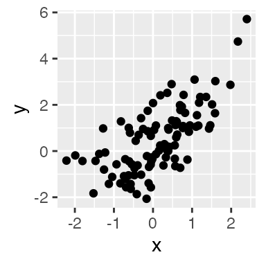
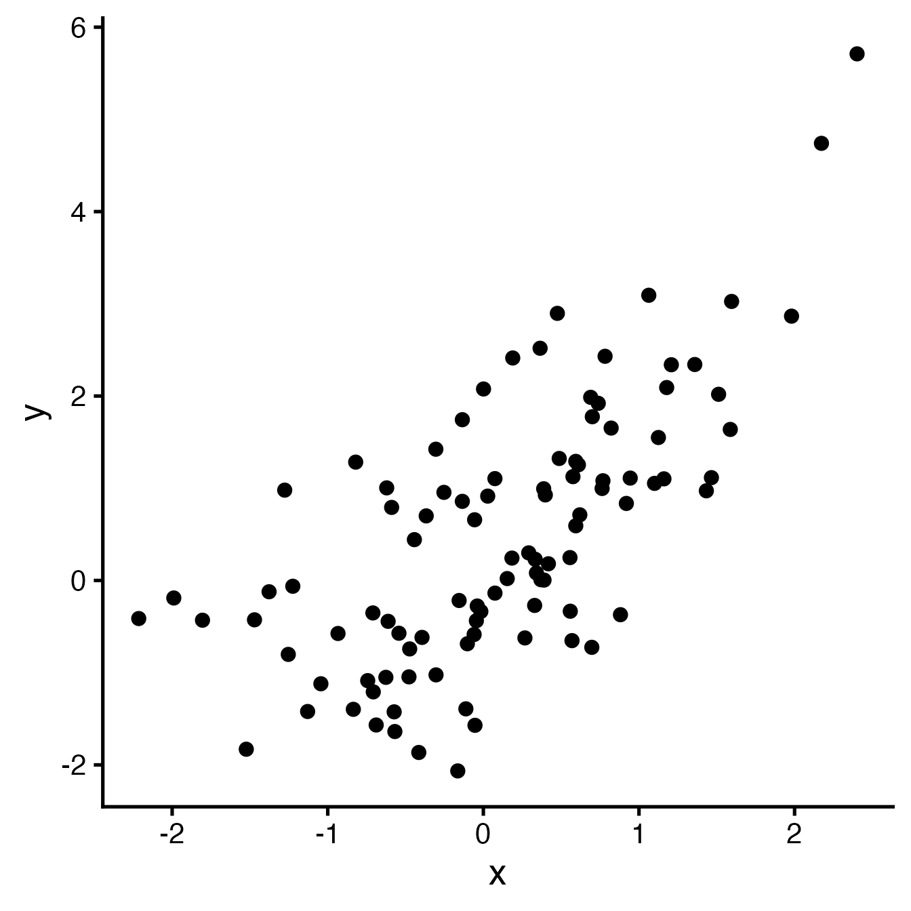
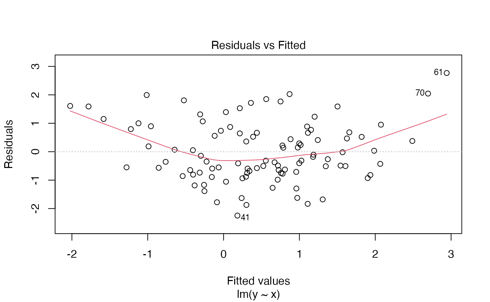
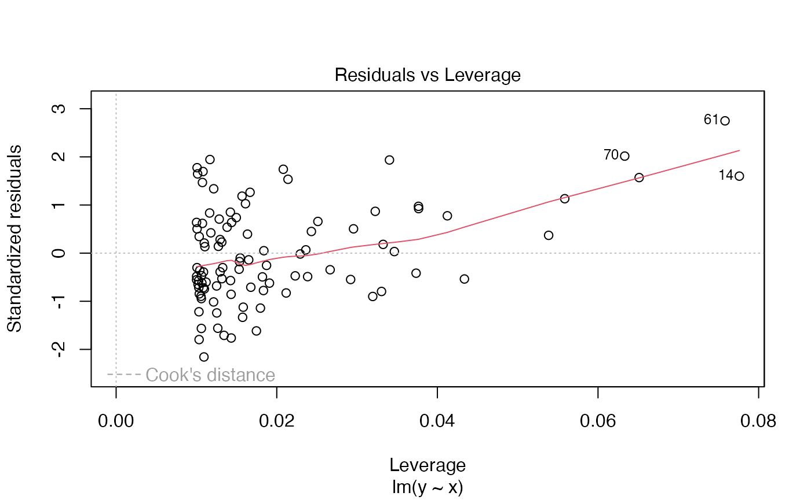

# Rmarkdown partial example

## Introduction

For example, you can make enlarge-able plots:

### Graphical relationship

``` r

library(rmdpartials)
library(ggplot2)
x <- rnorm(100)
y <- x + rnorm(100) + 0.5 * x^2
curve <- ggplot(mapping = aes(x, y)) + geom_point()
enlarge_plot(curve, large_plot = curve + theme_classic(base_size = 20), plot_name = "myplot")
```

[](#myplot)



Close

### Regression

``` r

reg <- lm(y ~ x)
regression_diagnostics(reg)
```

|             |         x |
|:------------|----------:|
| (Intercept) | 0.3592409 |
| x           | 1.0755503 |

Values vs. fitted values.


Diagnostics (click to show)



### Write a partial on the fly

``` r

x <- 5
y <- 9
partial(text = "`r x` `r y`")
```

5 9

### Debug

Learn about environments in partials.

``` r

knit_child_debug()
```

Debug

Working directory

    ## [1] "/Users/rubenarslan/research/rmdpartials/vignettes"

needs_preview()

    ## [1] FALSE

is_interactive()

    ## [1] FALSE

Knitr Output.dir

    ## [1] "/Users/rubenarslan/research/rmdpartials/vignettes"

Child mode

    ## [1] TRUE

Viewer null

    ## [1] TRUE

In tmp dir

    ## [1] FALSE

knitr.in.progress

    ## [1] TRUE

rstudio.notebook.executing

    ## NULL

TESTTHAT_interactive

    ## [1] ""

TESTTHAT

    ## [1] ""

interactive

    ## [1] FALSE

objects in this environment

    ## [1] "is_interactive" "needs_preview"

knitr::opts_knit

    ## $progress
    ## [1] FALSE
    ## 
    ## $verbose
    ## [1] FALSE
    ## 
    ## $eval.after
    ## [1] "fig.cap"  "fig.scap" "fig.alt" 
    ## 
    ## $base.dir
    ## NULL
    ## 
    ## $base.url
    ## NULL
    ## 
    ## $root.dir
    ## NULL
    ## 
    ## $child.path
    ## [1] ""
    ## 
    ## $upload.fun
    ## function (x) 
    ## x
    ## <bytecode: 0x144612760>
    ## <environment: namespace:base>
    ## 
    ## $global.device
    ## [1] FALSE
    ## 
    ## $global.par
    ## [1] FALSE
    ## 
    ## $concordance
    ## [1] FALSE
    ## 
    ## $documentation
    ## [1] 1
    ## 
    ## $self.contained
    ## [1] TRUE
    ## 
    ## $unnamed.chunk.label
    ## [1] "rmdpartial"
    ## 
    ## $highr.opts
    ## NULL
    ## 
    ## $label.prefix
    ##  table 
    ## "tab:" 
    ## 
    ## $latex.tilde
    ## NULL
    ## 
    ## $out.format
    ## [1] "markdown"
    ## 
    ## $child
    ## [1] TRUE
    ## 
    ## $parent
    ## [1] FALSE
    ## 
    ## $tangle
    ## [1] FALSE
    ## 
    ## $aliases
    ## NULL
    ## 
    ## $header
    ## highlight      tikz    framed 
    ##        ""        ""        "" 
    ## 
    ## $global.pars
    ## NULL
    ## 
    ## $rmarkdown.pandoc.from
    ## [1] "markdown+autolink_bare_uris+tex_math_single_backslash"
    ## 
    ## $rmarkdown.pandoc.to
    ## [1] "html"
    ## 
    ## $rmarkdown.pandoc.args
    ## [1] "--standalone"                                                                                       
    ## [2] "--section-divs"                                                                                     
    ## [3] "--template"                                                                                         
    ## [4] "/var/folders/tr/lgwjmdgd72bckr1hj5gd_7640000gq/T//Rtmp3ZPimv/pkgdown-rmd-template-a206225e4a11.html"
    ## [5] "--highlight-style"                                                                                  
    ## [6] "pygments"                                                                                           
    ## 
    ## $rmarkdown.pandoc.id_prefix
    ## [1] ""
    ## 
    ## $rmarkdown.keep_md
    ## [1] FALSE
    ## 
    ## $rmarkdown.df_print
    ## [1] "default"
    ## 
    ## $rmarkdown.version
    ## [1] 2
    ## 
    ## $rmarkdown.runtime
    ## [1] "static"
    ## 
    ## $output.dir
    ## [1] "/Users/rubenarslan/research/rmdpartials/vignettes"

knitr::opts_chunk

    ## $eval
    ## [1] TRUE
    ## 
    ## $echo
    ## [1] FALSE
    ## 
    ## $results
    ## [1] "markup"
    ## 
    ## $tidy
    ## [1] FALSE
    ## 
    ## $tidy.opts
    ## NULL
    ## 
    ## $collapse
    ## [1] FALSE
    ## 
    ## $prompt
    ## [1] FALSE
    ## 
    ## $comment
    ## [1] "##"
    ## 
    ## $highlight
    ## [1] TRUE
    ## 
    ## $size
    ## [1] "normalsize"
    ## 
    ## $background
    ## [1] "#F7F7F7"
    ## 
    ## $strip.white
    ## [1] TRUE
    ## 
    ## $cache
    ## [1] FALSE
    ## 
    ## $cache.path
    ## [1] "rmdpartials_cache/html/f080a7cff6_"
    ## 
    ## $cache.vars
    ## NULL
    ## 
    ## $cache.lazy
    ## [1] TRUE
    ## 
    ## $dependson
    ## NULL
    ## 
    ## $autodep
    ## [1] FALSE
    ## 
    ## $cache.rebuild
    ## [1] FALSE
    ## 
    ## $fig.keep
    ## [1] "high"
    ## 
    ## $fig.show
    ## [1] "asis"
    ## 
    ## $fig.align
    ## [1] "default"
    ## 
    ## $fig.path
    ## [1] "/Users/rubenarslan/research/rmdpartials/docs/articles/rmdpartials_files/figure-html/f080a7cff6_"
    ## 
    ## $dev
    ## [1] "ragg_png"
    ## 
    ## $dev.args
    ## $dev.args$bg
    ## [1] NA
    ## 
    ## 
    ## $dpi
    ## [1] 96
    ## 
    ## $fig.ext
    ## [1] "png"
    ## 
    ## $fig.width
    ## [1] 7.291667
    ## 
    ## $fig.height
    ## [1] 4.506593
    ## 
    ## $fig.env
    ## [1] "figure"
    ## 
    ## $fig.cap
    ## NULL
    ## 
    ## $fig.scap
    ## NULL
    ## 
    ## $fig.lp
    ## [1] "fig:"
    ## 
    ## $fig.subcap
    ## NULL
    ## 
    ## $fig.pos
    ## [1] ""
    ## 
    ## $out.width
    ## NULL
    ## 
    ## $out.height
    ## NULL
    ## 
    ## $out.extra
    ## NULL
    ## 
    ## $fig.retina
    ## [1] 2
    ## 
    ## $external
    ## [1] TRUE
    ## 
    ## $sanitize
    ## [1] FALSE
    ## 
    ## $interval
    ## [1] 1
    ## 
    ## $aniopts
    ## [1] "controls,loop"
    ## 
    ## $warning
    ## [1] TRUE
    ## 
    ## $error
    ## [1] FALSE
    ## 
    ## $message
    ## [1] TRUE
    ## 
    ## $render
    ## NULL
    ## 
    ## $ref.label
    ## NULL
    ## 
    ## $child
    ## NULL
    ## 
    ## $engine
    ## [1] "R"
    ## 
    ## $split
    ## [1] FALSE
    ## 
    ## $include
    ## [1] TRUE
    ## 
    ## $purl
    ## [1] TRUE
    ## 
    ## $other.parameters
    ## list()
    ## 
    ## $fig.class
    ## [1] "r-plt"

Sys.getenv()

    ## __CF_USER_TEXT_ENCODING
    ##                         0x1F7:0x0:0x0
    ## __CFBundleIdentifier    com.todesktop.230313mzl4w4u92
    ## _R_CHECK_LENGTH_1_LOGIC2_
    ##                         TRUE
    ## _ZO_DOCTOR              0
    ## ANDROID_HOME            /Users/rubenarslan/Library/Android/sdk
    ## BIBINPUTS               ::/Users/rubenarslan/research/rmdpartials/vignettes:/Library/Frameworks/R.framework/Versions/4.5-arm64/Resources/share/texmf/tex/latex
    ## BSTINPUTS               :/Users/rubenarslan/research/rmdpartials/vignettes:/Library/Frameworks/R.framework/Versions/4.5-arm64/Resources/share/texmf/bibtex/bst
    ## BUN_INSTALL_CACHE_DIR   /var/folders/tr/lgwjmdgd72bckr1hj5gd_7640000gq/T/cursor-sandbox-cache/214f8b88d7baf2108bff6373a58e2bf3/bun
    ## BUNDLE_PATH             /var/folders/tr/lgwjmdgd72bckr1hj5gd_7640000gq/T/cursor-sandbox-cache/214f8b88d7baf2108bff6373a58e2bf3/bundle
    ## CALLR_IS_RUNNING        true
    ## CARGO_TARGET_DIR        /var/folders/tr/lgwjmdgd72bckr1hj5gd_7640000gq/T/cursor-sandbox-cache/214f8b88d7baf2108bff6373a58e2bf3/cargo-target
    ## CCACHE_DIR              /var/folders/tr/lgwjmdgd72bckr1hj5gd_7640000gq/T/cursor-sandbox-cache/214f8b88d7baf2108bff6373a58e2bf3/ccache
    ## CI                      1
    ## CLICOLOR                1
    ## COMMAND_MODE            unix2003
    ## COMPOSER_HOME           /var/folders/tr/lgwjmdgd72bckr1hj5gd_7640000gq/T/cursor-sandbox-cache/214f8b88d7baf2108bff6373a58e2bf3/composer
    ## CONDA_PKGS_DIRS         /var/folders/tr/lgwjmdgd72bckr1hj5gd_7640000gq/T/cursor-sandbox-cache/214f8b88d7baf2108bff6373a58e2bf3/conda
    ## CP_HOME_DIR             /var/folders/tr/lgwjmdgd72bckr1hj5gd_7640000gq/T/cursor-sandbox-cache/214f8b88d7baf2108bff6373a58e2bf3/cocoapods
    ## CURSOR_AGENT            1
    ## CURSOR_EXTENSION_HOST_ROLE
    ##                         agent-exec
    ## CURSOR_TRACE_ID         5beffc6b9d2c4272b5b84a0ba00feae5
    ## CYGWIN                  nodosfilewarning
    ## CYPRESS_CACHE_FOLDER    /var/folders/tr/lgwjmdgd72bckr1hj5gd_7640000gq/T/cursor-sandbox-cache/214f8b88d7baf2108bff6373a58e2bf3/cypress
    ## DISPLAY                 /private/tmp/com.apple.launchd.kxr3jnq73y/org.xquartz:0
    ## DYLD_FALLBACK_LIBRARY_PATH
    ##                         /Library/Frameworks/R.framework/Versions/4.5-arm64/Resources/lib:/Library/Java/JavaVirtualMachines/jdk-11.0.18+10/Contents/Home/lib/server
    ## EDITOR                  vi
    ## ELECTRON_RUN_AS_NODE    1
    ## FORCE_COLOR             0
    ## GEM_SPEC_CACHE          /var/folders/tr/lgwjmdgd72bckr1hj5gd_7640000gq/T/cursor-sandbox-cache/214f8b88d7baf2108bff6373a58e2bf3/gem-specs
    ## GIT_ASKPASS             /Users/rubenarslan/Library/R/arm64/4.5/library/askpass/mac-askpass
    ## GOCACHE                 /var/folders/tr/lgwjmdgd72bckr1hj5gd_7640000gq/T/cursor-sandbox-cache/214f8b88d7baf2108bff6373a58e2bf3/go-build
    ## GOMODCACHE              /var/folders/tr/lgwjmdgd72bckr1hj5gd_7640000gq/T/cursor-sandbox-cache/214f8b88d7baf2108bff6373a58e2bf3/go-mod
    ## GRADLE_USER_HOME        /var/folders/tr/lgwjmdgd72bckr1hj5gd_7640000gq/T/cursor-sandbox-cache/214f8b88d7baf2108bff6373a58e2bf3/gradle
    ## HOME                    /Users/rubenarslan
    ## HOMEBREW_CACHE          /var/folders/tr/lgwjmdgd72bckr1hj5gd_7640000gq/T/cursor-sandbox-cache/214f8b88d7baf2108bff6373a58e2bf3/homebrew
    ## HOMEBREW_CELLAR         /opt/homebrew/Cellar
    ## HOMEBREW_PREFIX         /opt/homebrew
    ## HOMEBREW_REPOSITORY     /opt/homebrew
    ## IN_PKGDOWN              true
    ## INFOPATH                /opt/homebrew/share/info:/opt/homebrew/share/info:
    ## LANG                    en_US.UTF-8
    ## LANGUAGE                en-GB
    ## LC_ALL                  en_US.UTF-8
    ## LN_S                    ln -s
    ## LOGNAME                 rubenarslan
    ## MAKE                    make
    ## MallocNanoZone          0
    ## NO_COLOR                1
    ## NPM_CONFIG_CACHE        /var/folders/tr/lgwjmdgd72bckr1hj5gd_7640000gq/T/cursor-sandbox-cache/214f8b88d7baf2108bff6373a58e2bf3/npm
    ## npm_config_devdir       /var/folders/tr/lgwjmdgd72bckr1hj5gd_7640000gq/T/cursor-sandbox-cache/214f8b88d7baf2108bff6373a58e2bf3/node-gyp
    ## NUGET_PACKAGES          /var/folders/tr/lgwjmdgd72bckr1hj5gd_7640000gq/T/cursor-sandbox-cache/214f8b88d7baf2108bff6373a58e2bf3/nuget
    ## NX_CACHE_DIRECTORY      /var/folders/tr/lgwjmdgd72bckr1hj5gd_7640000gq/T/cursor-sandbox-cache/214f8b88d7baf2108bff6373a58e2bf3/nx
    ## PAGER                   /usr/bin/less
    ## PATH                    /opt/homebrew/bin:/opt/homebrew/sbin:/Applications/arx-3.6.0.app/Contents/bin:/Library/TeX/Root/bin/x86_64-darwin/:/usr/local/bin:/opt/local/bin:/opt/local/sbin:/usr/bin:/bin:/usr/sbin:/sbin:/opt/X11/bin:/Users/rubenarslan/Library/Android/sdk/tools:/Users/rubenarslan/Library/Android/sdk/platform-tools:/Users/rubenarslan/.local/bin
    ## PIP_CACHE_DIR           /var/folders/tr/lgwjmdgd72bckr1hj5gd_7640000gq/T/cursor-sandbox-cache/214f8b88d7baf2108bff6373a58e2bf3/pip
    ## PLAYWRIGHT_BROWSERS_PATH
    ##                         /var/folders/tr/lgwjmdgd72bckr1hj5gd_7640000gq/T/cursor-sandbox-cache/214f8b88d7baf2108bff6373a58e2bf3/playwright
    ## PNPM_STORE_PATH         /var/folders/tr/lgwjmdgd72bckr1hj5gd_7640000gq/T/cursor-sandbox-cache/214f8b88d7baf2108bff6373a58e2bf3/pnpm-store
    ## POETRY_CACHE_DIR        /var/folders/tr/lgwjmdgd72bckr1hj5gd_7640000gq/T/cursor-sandbox-cache/214f8b88d7baf2108bff6373a58e2bf3/poetry
    ## PROCESSX_PSa1ae48c711a0_1771674431
    ##                         YES
    ## PROCESSX_PSa2067b81c61e_1771674438
    ##                         YES
    ## PUPPETEER_CACHE_DIR     /var/folders/tr/lgwjmdgd72bckr1hj5gd_7640000gq/T/cursor-sandbox-cache/214f8b88d7baf2108bff6373a58e2bf3/puppeteer
    ## PWD                     /Users/rubenarslan/research/rmdpartials
    ## R_ARCH                  
    ## R_BROWSER               false
    ## R_BZIPCMD               /usr/bin/bzip2
    ## R_CLI_NUM_COLORS        256
    ## R_DOC_DIR               /Library/Frameworks/R.framework/Versions/4.5-arm64/Resources/doc
    ## R_GZIPCMD               /usr/bin/gzip
    ## R_HOME                  /Library/Frameworks/R.framework/Versions/4.5-arm64/Resources
    ## R_INCLUDE_DIR           /Library/Frameworks/R.framework/Versions/4.5-arm64/Resources/include
    ## R_LIBS_SITE             /Library/Frameworks/R.framework/Versions/4.5-arm64/Resources/site-library
    ## R_LIBS_USER             /Users/rubenarslan/Library/R/arm64/4.5/library
    ## R_MAX_VSIZE             16000000000
    ## R_PAPERSIZE             a4
    ## R_PAPERSIZE_USER        a4
    ## R_PDFVIEWER             false
    ## R_PLATFORM              aarch64-apple-darwin20
    ## R_PRINTCMD              lpr
    ## R_QPDF                  /Library/Frameworks/R.framework/Versions/4.5-arm64/Resources/bin/qpdf
    ## R_RD4PDF                times,inconsolata,hyper
    ## R_SESSION_TMPDIR        /var/folders/tr/lgwjmdgd72bckr1hj5gd_7640000gq/T//Rtmpk94Rf8
    ## R_SHARE_DIR             /Library/Frameworks/R.framework/Versions/4.5-arm64/Resources/share
    ## R_STRIP_SHARED_LIB      strip -x
    ## R_STRIP_STATIC_LIB      strip -S
    ## R_TESTS                 
    ## R_TEXI2DVICMD           /opt/R/arm64/bin/texi2dvi
    ## R_UNZIPCMD              /usr/bin/unzip
    ## R_ZIPCMD                /usr/bin/zip
    ## RENV_PATHS_ROOT         /Library/Frameworks/renv
    ## SED                     /usr/bin/sed
    ## SHELL                   /bin/bash
    ## SHLVL                   2
    ## SSH_ASKPASS             /Users/rubenarslan/Library/R/arm64/4.5/library/askpass/mac-askpass
    ## SSH_AUTH_SOCK           /private/tmp/com.apple.launchd.vOxIKmRWXY/Listeners
    ## TAR                     /usr/bin/tar
    ## TERM                    dumb
    ## TEXINPUTS               :/Users/rubenarslan/research/rmdpartials/vignettes:/Library/Frameworks/R.framework/Versions/4.5-arm64/Resources/share/texmf/tex/latex
    ## TMPDIR                  /var/folders/tr/lgwjmdgd72bckr1hj5gd_7640000gq/T/
    ## TURBO_CACHE_DIR         /var/folders/tr/lgwjmdgd72bckr1hj5gd_7640000gq/T/cursor-sandbox-cache/214f8b88d7baf2108bff6373a58e2bf3/turbo
    ## TWITTER_PAT             /Users/rubenarslan/.rtweet_token4.rds
    ## USER                    rubenarslan
    ## UV_CACHE_DIR            /var/folders/tr/lgwjmdgd72bckr1hj5gd_7640000gq/T/cursor-sandbox-cache/214f8b88d7baf2108bff6373a58e2bf3/uv
    ## VSCODE_CODE_CACHE_PATH
    ##                         /Users/rubenarslan/Library/Application
    ##                         Support/Cursor/CachedData/7b98dcb824ea96c9c62362a5e80dbf0d1aae4770
    ## VSCODE_CRASH_REPORTER_PROCESS_TYPE
    ##                         extensionHost
    ## VSCODE_CWD              /
    ## VSCODE_ESM_ENTRYPOINT   vs/workbench/api/node/extensionHostProcess
    ## VSCODE_HANDLES_UNCAUGHT_ERRORS
    ##                         true
    ## VSCODE_IPC_HOOK         /Users/rubenarslan/Library/Application
    ##                         Support/Cursor/2.5.-main.sock
    ## VSCODE_NLS_CONFIG       {"userLocale":"en-gb","osLocale":"en-de","resolvedLanguage":"en","defaultMessagesFile":"/Applications/Cursor.app/Contents/Resources/app/out/nls.messages.json","locale":"en-gb","availableLanguages":{}}
    ## VSCODE_PID              94585
    ## VSCODE_PROCESS_TITLE    extension-host (agent-exec) [8-47]
    ## XPC_FLAGS               0x0
    ## XPC_SERVICE_NAME        0
    ## YARN_CACHE_FOLDER       /var/folders/tr/lgwjmdgd72bckr1hj5gd_7640000gq/T/cursor-sandbox-cache/214f8b88d7baf2108bff6373a58e2bf3/yarn

options()

    ## $add.smooth
    ## [1] TRUE
    ## 
    ## $bitmapType
    ## [1] "quartz"
    ## 
    ## $browser
    ## [1] "false"
    ## 
    ## $browserNLdisabled
    ## [1] FALSE
    ## 
    ## $callr.condition_handler_cli_message
    ## function (msg) 
    ## {
    ##     custom_handler <- getOption("cli.default_handler")
    ##     if (is.function(custom_handler)) {
    ##         custom_handler(msg)
    ##     }
    ##     else {
    ##         cli_server_default(msg)
    ##     }
    ## }
    ## <bytecode: 0x1072967d0>
    ## <environment: namespace:cli>
    ## 
    ## $callr.rprofile_loaded
    ## [1] TRUE
    ## 
    ## $catch.script.errors
    ## [1] FALSE
    ## 
    ## $CBoundsCheck
    ## [1] FALSE
    ## 
    ## $check.bounds
    ## [1] FALSE
    ## 
    ## $citation.bibtex.max
    ## [1] 1
    ## 
    ## $continue
    ## [1] "+ "
    ## 
    ## $contrasts
    ##         unordered           ordered 
    ## "contr.treatment"      "contr.poly" 
    ## 
    ## $defaultPackages
    ## [1] "datasets"  "utils"     "grDevices" "graphics"  "stats"     "methods"  
    ## 
    ## $demo.ask
    ## [1] "default"
    ## 
    ## $deparse.cutoff
    ## [1] 60
    ## 
    ## $device
    ## function (width = 7, height = 7, ...) 
    ## {
    ##     grDevices::pdf(NULL, width, height, ...)
    ## }
    ## <bytecode: 0x144677d88>
    ## <environment: namespace:knitr>
    ## 
    ## $device.ask.default
    ## [1] FALSE
    ## 
    ## $digits
    ## [1] 7
    ## 
    ## $dplyr.show_progress
    ## [1] TRUE
    ## 
    ## $dvipscmd
    ## [1] "dvips"
    ## 
    ## $echo
    ## [1] FALSE
    ## 
    ## $editor
    ## [1] "vi"
    ## 
    ## $encoding
    ## [1] "native.enc"
    ## 
    ## $error
    ## (function () 
    ## invokeRestart("abort"))()
    ## 
    ## $example.ask
    ## [1] "default"
    ## 
    ## $expressions
    ## [1] 5000
    ## 
    ## $help.search.types
    ## [1] "vignette" "demo"     "help"    
    ## 
    ## $help.try.all.packages
    ## [1] FALSE
    ## 
    ## $htmltools.preserve.raw
    ## [1] TRUE
    ## 
    ## $HTTPUserAgent
    ## [1] "R (4.5.1 aarch64-apple-darwin20 aarch64 darwin20)"
    ## 
    ## $install.packages.compile.from.source
    ## [1] "interactive"
    ## 
    ## $internet.info
    ## [1] 2
    ## 
    ## $keep.parse.data
    ## [1] TRUE
    ## 
    ## $keep.parse.data.pkgs
    ## [1] FALSE
    ## 
    ## $keep.source
    ## [1] FALSE
    ## 
    ## $keep.source.pkgs
    ## [1] FALSE
    ## 
    ## $knitr.duplicate.label
    ## [1] "allow"
    ## 
    ## $knitr.graphics.rel_path
    ## [1] FALSE
    ## 
    ## $knitr.in.progress
    ## [1] TRUE
    ## 
    ## $locatorBell
    ## [1] TRUE
    ## 
    ## $mailer
    ## [1] "mailto"
    ## 
    ## $matprod
    ## [1] "default"
    ## 
    ## $max.contour.segments
    ## [1] 25000
    ## 
    ## $max.print
    ## [1] 99999
    ## 
    ## $menu.graphics
    ## [1] TRUE
    ## 
    ## $na.action
    ## [1] "na.omit"
    ## 
    ## $nwarnings
    ## [1] 50
    ## 
    ## $OutDec
    ## [1] "."
    ## 
    ## $pager
    ## [1] "/Library/Frameworks/R.framework/Versions/4.5-arm64/Resources/bin/pager"
    ## 
    ## $papersize
    ## [1] "a4"
    ## 
    ## $PCRE_limit_recursion
    ## [1] NA
    ## 
    ## $PCRE_study
    ## [1] FALSE
    ## 
    ## $PCRE_use_JIT
    ## [1] TRUE
    ## 
    ## $pdfviewer
    ## [1] "false"
    ## 
    ## $pkgType
    ## [1] "both"
    ## 
    ## $printcmd
    ## [1] "lpr"
    ## 
    ## $prompt
    ## [1] "> "
    ## 
    ## $repos
    ##                          CRAN 
    ## "https://cloud.r-project.org" 
    ## 
    ## $rl_word_breaks
    ## [1] " \t\n\"\\'`><=%;,|&{()}"
    ## 
    ## $rlang_trace_top_env
    ## <environment: R_GlobalEnv>
    ## 
    ## $scipen
    ## [1] 0
    ## 
    ## $show.coef.Pvalues
    ## [1] TRUE
    ## 
    ## $show.error.messages
    ## [1] TRUE
    ## 
    ## $show.signif.stars
    ## [1] TRUE
    ## 
    ## $showErrorCalls
    ## [1] TRUE
    ## 
    ## $showNCalls
    ## [1] 50
    ## 
    ## $showWarnCalls
    ## [1] FALSE
    ## 
    ## $str
    ## $str$strict.width
    ## [1] "no"
    ## 
    ## $str$digits.d
    ## [1] 3
    ## 
    ## $str$vec.len
    ## [1] 4
    ## 
    ## $str$list.len
    ## [1] 99
    ## 
    ## $str$deparse.lines
    ## NULL
    ## 
    ## $str$drop.deparse.attr
    ## [1] TRUE
    ## 
    ## $str$formatNum
    ## function (x, ...) 
    ## format(x, trim = TRUE, drop0trailing = TRUE, ...)
    ## <environment: 0x144218190>
    ## 
    ## 
    ## $str.dendrogram.last
    ## [1] "`"
    ## 
    ## $texi2dvi
    ## [1] "/opt/R/arm64/bin/texi2dvi"
    ## 
    ## $tikzMetricsDictionary
    ## [1] "rmdpartials-tikzDictionary"
    ## 
    ## $timeout
    ## [1] 60
    ## 
    ## $try.outFile
    ## A connection with                    
    ## description ""      
    ## class       "file"  
    ## mode        "w+b"   
    ## text        "binary"
    ## opened      "opened"
    ## can read    "yes"   
    ## can write   "yes"   
    ## 
    ## $ts.eps
    ## [1] 1e-05
    ## 
    ## $ts.S.compat
    ## [1] FALSE
    ## 
    ## $unzip
    ## [1] "/usr/bin/unzip"
    ## 
    ## $useFancyQuotes
    ## [1] FALSE
    ## 
    ## $verbose
    ## [1] FALSE
    ## 
    ## $warn
    ## [1] 0
    ## 
    ## $warning.length
    ## [1] 1000
    ## 
    ## $warnPartialMatchArgs
    ## [1] FALSE
    ## 
    ## $warnPartialMatchAttr
    ## [1] FALSE
    ## 
    ## $warnPartialMatchDollar
    ## [1] FALSE
    ## 
    ## $width
    ## [1] 80
